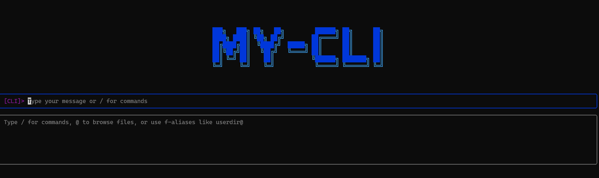

# My-CLI

<div align="center">
  
</div>

<br />

A powerful, multi-modal command-line interface that combines traditional CLI functionality with AI-powered chat and intelligent command assistance. Built with React, TypeScript, and Ink for a modern terminal experience.

## 🚀 Features

### 🎯 Multiple Operating Modes
- **Command Mode**: Traditional CLI with enhanced features and command history
- **Chat Mode**: Direct conversation with AI assistant (Anthropic Claude)
- **Agent Mode**: Specialized AI assistant focused on command-line operations
- **Search Mode**: Intelligent command history search and execution

### 💡 Smart Features
- **AI-Powered Command Help**: Get intelligent suggestions and explanations for commands
- **Persistent Command History**: All commands are saved and searchable
- **File Browser Integration**: Navigate files with `@` trigger (e.g., `ls @` to browse current directory)
- **F-Aliases**: Custom directory shortcuts (e.g., `userdir@` for quick navigation)
- **Real-time Working Directory Tracking**: Always know where you are
- **Cross-Platform Support**: Works on Windows, macOS, and Linux

### 🎨 User Experience
- **Intuitive Navigation**: Keyboard shortcuts for quick mode switching
- **Visual Command Selection**: Color-coded interface with clear visual feedback
- **Rich Terminal Output**: Syntax highlighting and structured responses
- **Responsive Design**: Adapts to different terminal sizes

## 📦 Installation

### From NPM (Recommended)
```bash
npm install -g @zentiencelabs/my-cli
```

### From Source
```bash
git clone https://github.com/yourusername/my-cli.git
cd my-cli
pnpm install
pnpm run build
npm link
```

## ⚡ Quick Start

1. **Install the package**:
   ```bash
   npm install -g @zentiencelabs/my-cli
   ```

2. **Run the CLI**:
   ```bash
   my-cli
   ```

3. **Configure your API key** (for AI features):
   - Type `/settings` and press Enter
   - Add your Anthropic API key
   - Save settings and return to main interface

4. **Start using different modes**:
   - **Command mode**: Type any shell command (e.g., `ls`, `git status`)
   - **Chat mode**: Press `Ctrl+↑/↓` to switch modes, then ask questions
   - **Agent mode**: Get command-specific help and suggestions
   - **Search mode**: Search your command history

## 🎮 Usage Guide

### Mode Switching
- **Ctrl + ↑/↓**: Cycle through modes (Command → Chat → Agent → Search)
- **Slash commands**: Type `/chat`, `/agent`, `/search`, `/cli` to switch directly

### Command Mode Features
```bash
# Traditional commands work as expected
ls -la
git status
npm install

# Enhanced features
/cwd /path/to/directory    # Change working directory
@                          # Browse current directory
c@                         # Browse C: drive (Windows)
userdir@                   # Use f-alias shortcuts
```

### Chat Mode
Ask general questions and get AI-powered responses:
```
> How do I set up a new React project?
> What's the difference between git merge and git rebase?
> Explain how Docker works
```

### Agent Mode
Get specialized command-line assistance:
```
> How do I find files larger than 100MB?
> Show me git commands for undoing commits
> Docker commands for container management
```

### Search Mode
Search and execute from command history:
```
# Search for specific commands
git

# Show all commands
**

# Navigate with ↑/↓, Enter to select, Enter again to execute
# Delete key removes commands from history
```

### File Browser
Use `@` to trigger the file browser:
```bash
# Browse current directory
ls @

# Browse specific drives (Windows)
cd c@

# Use f-aliases for quick access
cd userdir@
```

## ⚙️ Configuration

### Settings Access
Type `/settings` in any mode to configure:

- **Provider**: AI provider (currently supports Anthropic)
- **Model**: Choose Claude model (haiku, sonnet, opus)
- **API Key**: Your Anthropic API key

### F-Aliases Setup
Create custom directory shortcuts:
```bash
# In the CLI, create an f-alias
# This creates a shortcut "userdir@" that points to your user directory
```

### Environment Variables
```bash
# Optional: Set your API key via environment variable
export ANTHROPIC_API_KEY="your_api_key_here"
```

## 🔧 Development

### Prerequisites
- Node.js 18+
- pnpm (recommended) or npm

### Setup
```bash
# Clone the repository
git clone https://github.com/yourusername/my-cli.git
cd my-cli

# Install dependencies
pnpm install

# Start development mode
pnpm run dev

# Build for production
pnpm run build

# Run tests
pnpm test
```

### Project Structure
```
src/
├── components/          # React components for UI
│   ├── Cli.tsx         # Main CLI component
│   ├── ChatSession.tsx # Chat mode interface
│   ├── AgentSession.tsx# Agent mode interface
│   └── Settings.tsx    # Settings configuration
├── services/           # Business logic
│   └── cliExecutor.ts  # Command execution service
├── utils/              # Utilities
│   ├── config.ts       # Configuration management
│   ├── storage.ts      # Data persistence
│   └── langGraphAgent.ts# AI agent logic
├── types/              # TypeScript definitions
└── bin.ts              # Entry point
```

## 🤝 Contributing

We welcome contributions! Here's how to get started:

### Getting Started
1. **Fork the repository**
2. **Create a feature branch**: `git checkout -b feature/amazing-feature`
3. **Make your changes**
4. **Test thoroughly**: `pnpm test && pnpm run build`
5. **Commit with conventional commits**: `git commit -m "feat: add amazing feature"`
6. **Push to your branch**: `git push origin feature/amazing-feature`
7. **Open a Pull Request**

### Development Guidelines
- **Code Style**: Follow existing TypeScript/React patterns
- **Testing**: Add tests for new features
- **Documentation**: Update README and code comments
- **Performance**: Consider terminal rendering performance
- **Accessibility**: Ensure keyboard navigation works properly

### Areas for Contribution
- **New AI Providers**: Add support for OpenAI, Google, etc.
- **Enhanced File Browser**: More file operations and previews
- **Plugin System**: Extensible command system
- **Themes**: Customizable color schemes
- **Shell Integration**: Better integration with different shells
- **Performance**: Optimize rendering and command execution
- **Documentation**: Improve guides and examples

### Running Tests
```bash
# Run all tests
pnpm test

# Run tests in watch mode
pnpm test --watch

# Run linting
pnpm run lint

# Type checking
pnpm run typecheck
```

### Code Quality
We use:
- **TypeScript** for type safety
- **ESLint** for code linting
- **Prettier** for code formatting
- **Conventional Commits** for commit messages

## 📋 Requirements

- **Node.js**: Version 18.0.0 or higher
- **Terminal**: Modern terminal with Unicode support
- **API Key**: Anthropic API key for AI features (optional)

## 🔗 Links

- **NPM Package**: https://www.npmjs.com/package/@zentiencelabs/my-cli
- **GitHub Repository**: https://github.com/yourusername/my-cli
- **Issues**: https://github.com/yourusername/my-cli/issues
- **Anthropic API**: https://www.anthropic.com/api

## 📝 License

MIT License - see [LICENSE](LICENSE) file for details.

## 🙏 Acknowledgments

- **Anthropic** for providing Claude AI API
- **Ink** for React-based terminal interfaces
- **LangChain** for AI integration utilities
- **React** for the component architecture

---

**Happy commanding! 🚀**

Made with ❤️ by [N Ashok Kumar](mailto:ashok@zentience.co)